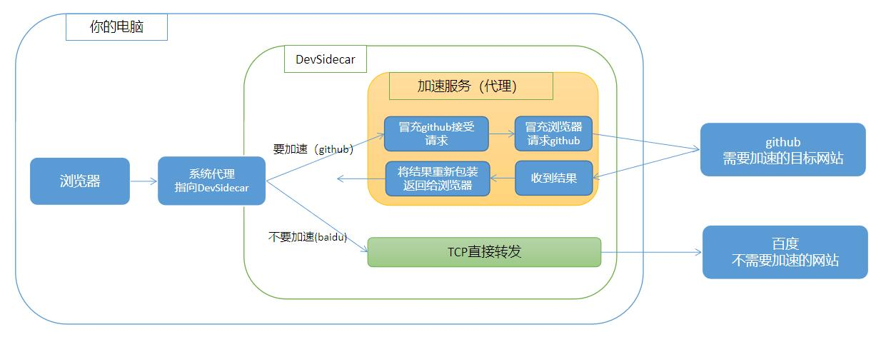

# 关于信任根证书的说明

## 一、为什么要信任根证书。

要回答这个问题需要先掌握下面两个知识点
### 知识点1：什么是根证书
[百度百科-什么是根证书](https://baike.baidu.com/item/%E6%A0%B9%E8%AF%81%E4%B9%A6/9874620?fr=aladdin)

当访问目标网站是https协议时，服务器会发送一个由根证书签发的网站ssl证书给浏览器，让浏览器用这个ssl证书给数据加密。   
浏览器需要先验证这个证书的真伪，之后才会使用证书加密。    
证书的真伪是通过验证证书的签发机构的证书是否可信，一直追溯到最初始的签发机构的证书（根证书）。    
浏览器只需信任根证书，间接的就信任了这条证书链下签发的所有证书。

windows、mac、linux或者浏览器他们都内置了市面上可信的大型证书颁发机构的根证书。

### 知识点2：中间人攻击
本应用的实现原理如下图：       

> 简单来说就是DevSidecar在本地启动了一个代理服务器帮你访问目标网站。   
> 实际上就是 [中间人攻击](https://baike.baidu.com/item/%E4%B8%AD%E9%97%B4%E4%BA%BA%E6%94%BB%E5%87%BB/1739730?fr=aladdin) 的原理，只是本应用没有用它来干坏事，而是帮助开发者加速目标网站的访问。

### 现在可以回答为什么要信任根证书

当目标网站不需要加速拦截时，直接走TCP转发，不需要中间人攻击，没有安全风险，在此不多做讨论。

当目标网站需要拦截时（例如github），就需要通过中间人攻击修改请求或者请求其他替代网站，从而达到加速的目的。

例如加速github就需要修改如下几处

1. 直连访问github需要修改tls握手时的sni域名，规避***的sni阻断问题。
2. asserts.github.com等静态资源拦截替换成fastgit.org的镜像地址

DevSidecar在第一次启动时会在本地随机生成一份根证书，当有用户访问github时，就用这份根证书来签发一份假的叫github.com的证书。
如果浏览器事先信任了这份根证书，那么就可以正常访问DevSidecar返回的网页内容了。

## 二、信任根证书有安全风险吗

1. 根证书是DevSidecar第一次启动时本地随机生成的，除了你这台电脑没人知道这份根证书的内容。
2. 代理请求目标网站时会校验目标网站的证书（除非关闭了`代理校验ssl`）。

> 所以信任根证书没有问题。    
> 但如果应用本身来源不明，或者`拦截配置`里的替代网站作恶，则有安全风险。    

> 对于应用来源风险：    
> 请勿从未知网站下载DevSidecar应用，认准官方版本发布地址  
> [Gitee Release](https://gitee.com/docmirror/dev-sidecar/releases)  
> [Github Release](https://github.com/docmirror/dev-sidecar/releases)
> 
> 或者从源码自行编译安装

> 对于拦截配置里的替代网站风险：   
> 1. 尽量缩小替代配置的范围
> 2. 不使用来源不明的镜像地址，尽量使用知名度较高的镜像地址
> 3. 你也可以将其他拦截配置全部删除，只保留github相关配置
> 

